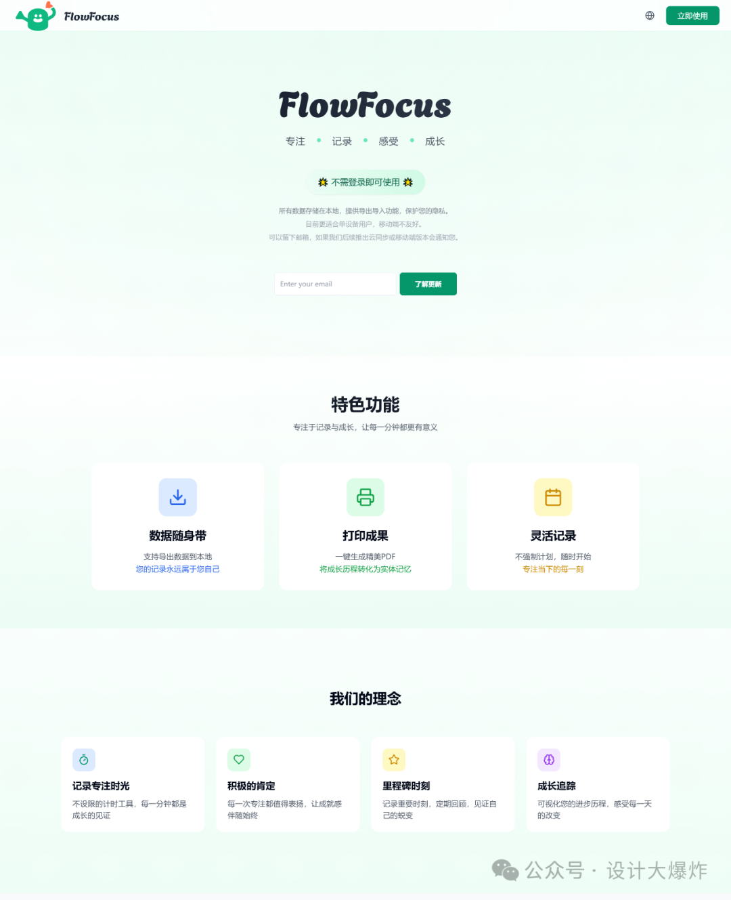
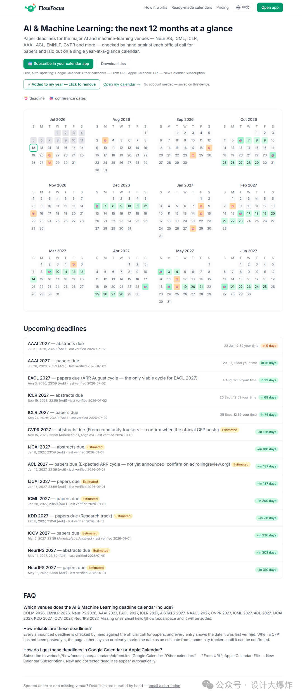
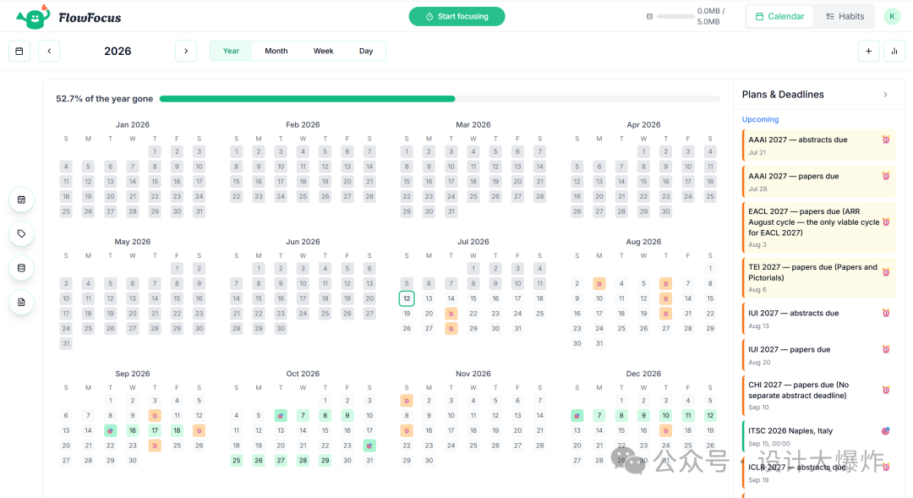
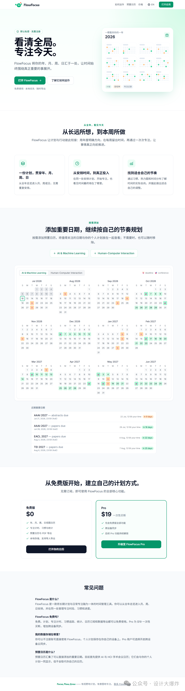
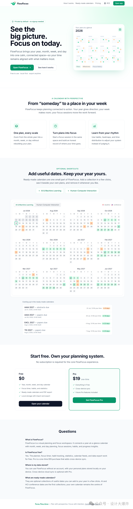
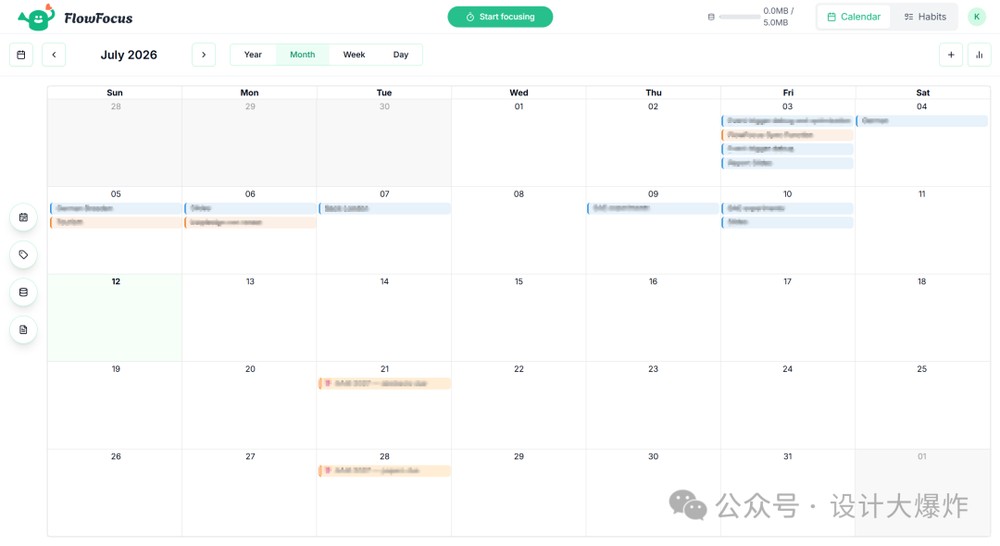

去年，我写了一篇文章，记录自己如何借助 AI 编程，从零做出了第一个小产品 FlowFocus [AI 编程完成的第一个小产品 FlowFocus 上线！从想法到产品，我学到了这些。](https://mp.weixin.qq.com/s?__biz=MzU0MTg4NTYzMw==&mid=2247485779&idx=1&sn=ae7b2cc78f481f213aa8f0e222cb835f&scene=21#wechat_redirect)

那时候的我非常兴奋。作为一个设计师，我第一次发现，即使不会完整地写代码，也可以通过和 AI 对话，把一个想法做成真正能打开、能使用、能上线的产品。但在那篇文章之后，我还写过另一篇没那么兴奋的复盘。

FlowFocus 最初把所有数据保存在浏览器本地。上线后，我连续使用了两周，却因为一次误清浏览器缓存，丢失了所有记录。面对空空如也的界面，我特别难受，甚至一度不想再打开这个产品。

这件事让我意识到，对于记录类产品来说，只有本地存储和手动导出备份远远不够。普通用户不会每天记得备份，一次误操作就可能让之前的记录全部消失。

所以，我决定借助 AI，把 FlowFocus 接入 Supabase，增加账户和云同步。刚开始进展很快，AI 很快生成了数据库结构、接口和相关代码。但因为数据库结构、安全策略和同步逻辑都没有规划清楚，后面的对话里，AI 逐渐忘记了自己之前的设计。表名变了，字段变了，权限规则也跟着变了。一个地方刚刚修好，另一个地方又开始报错。

折腾三天之后，我得到的是一个超级混乱、根本无法正常运行的代码库。我把这次经历写成了 [从零到崩溃：设计师尝试AI编程为小产品FlowFocus实现云端同步的失败经验总结](https://mp.weixin.qq.com/s?__biz=MzU0MTg4NTYzMw==&mid=2247485846&idx=1&sn=77b3119fa37434eea28cf9d91f7234eb&scene=21#wechat_redirect)。最后不得不放弃。

在当时我还列了一串以后想做的事情：账户管理、云同步、移动端适配、多语言，以及更多围绕时间管理的体验……但说实话，当时我也不知道这些功能什么时候才能完成。基础页面、按钮，AI 已经可以帮我实现。但一涉及账户系统、数据库、跨设备同步、数据冲突和线上部署，事情就会迅速变得复杂。

很多时候不是 AI 写不出某一段代码，而是我不知道下一步该问什么，也不知道它给出的方案放进整个产品里是否可靠。

所以 FlowFocus 上线之后，我很长一段时间都没有再更新它。直到最近，我重新打开了这个项目。

旧版主页 （😂）↓

然后我发现：**仅仅过了一年，AI 编程的体验已经完全不一样了**。

## 1. 去年做失败的功能，现在可以需求开始

这次最明显的感受是随着AI能力的变化我和 AI 对话的方式也变了。

2025 年，我通常会对 AI 说：

“帮我做一个登录页面。”

“在这里增加一个语言切换按钮。”

“这个报错怎么解决？”

那时候，我对待AI 更像一个随时可以提问的程序员。它能帮我写某个页面、修改某段代码，或者解释一个错误。但我仍然需要自己把产品拆成很多小块，再逐个告诉它应该做什么，但事实上很多时候我也并不知道要做什么。

更大的问题是，当任务开始涉及多个页面、数据库和用户权限时，AI 很难持续记住前面做过的决定。它可以修复眼前的错误，却不一定知道这个修改会不会破坏整个系统。

这一次，我可以直接从完整的产品需求开始。

比如，我对 AI 说：

> 我想给 FlowFocus 增加账户和跨设备同步，但不希望用户必须注册才能使用。免费用户的数据继续保存在本地，登录后的 Pro 用户可以同步。同时还要考虑离线使用和数据冲突，不能因为同步导致用户数据丢失。

这是一个同时包含产品逻辑、技术架构、商业模式和异常情况的需求。

如果放在去年，我可能需要先研究 Supabase、登录状态、数据库权限和同步机制，再尝试把它们一点点拼起来，来试图让AI了解我的意图。

但这次，AI 没有直接生成一堆代码。它先读取了整个 FlowFocus 项目，了解现有数据放在哪里、哪些功能依赖这些数据，以及之前残留的云端代码是否还能使用。然后，它和我一起分析了几种方案，最后确定“本地优先＋后台同步”的结构：用户不登录也可以正常使用；数据首先写入本地；登录后再同步到云端；离线修改不会丢失；两台设备的数据发生冲突时，根据更新时间进行处理；非空数据被覆盖之前，还会保留一份备份。

接下来，它继续拆分任务，建立数据库、配置用户权限、实现注册登录、找回密码、同步状态和冲突处理，最后补上测试。

我做的主要事情，变成了确认产品规则和体验是否符合预期。

这种感觉非常奇妙。

不是某一段代码突然变得简单了，而是以前需要自己查资料、做架构、拆任务和反复调试的整条链路，可以在同一个上下文里持续推进。

## 2. AI 不再只是执行需求，开始理解整个产品

这次我还做了一个很大的调整：重新思考 FlowFocus 到底解决什么问题。

最初的 FlowFocus 是一个比较完整，但也比较泛的效率工具。它有年、月、周、日视图，有时间记录、习惯打卡、统计和数据导出。功能不少，但很难用一句话解释它和其他效率工具有什么不同。

重新和 AI 梳理产品时，我们回到了我最喜欢、也最有辨识度的功能：年视图。普通日历擅长告诉你今天和下周要做什么，但很多重要的事情，比如论文截稿、项目里程碑、考试、比赛、旅行和人生计划，需要放到一整年的尺度里看。

所以这次，FlowFocus 的定位逐渐变成了一个“可视化年度规划工具”。在个人日历之外，我还增加了 AI 和 HCI 领域的学术会议日历。用户可以直接看到未来一年的论文截稿时间，把公共日历叠加到自己的年度计划中，也可以通过 Webcal 或 ICS 订阅到其他日历软件。每个会议都有独立页面，包含截稿时间、时区转换、倒计时、会议日期和信息来源。

这部分最让我惊讶的，并不是 AI 写出了多少页面，而是它能够理解：

- 为什么年视图可能是产品真正的差异点；
- 公共日历订阅能为什么人提供什么价值；
- 免费功能和付费功能应该怎样划分；

过去，我觉得“产品思考”和“写代码”是两个相对独立的过程。现在，它们越来越像同一场对话。我可以先讨论用户是谁、产品的问题在哪里，再继续讨论页面结构、数据模型和实现方式。前面做出的产品决定，会直接成为后面写代码时的上下文。

AI 不只是收到一个按钮就做一个按钮，而是开始理解这个按钮为什么存在、它前后连接着什么，即使我没有说清楚，他也会引导着做出这些讨论。

## 3. 多语言不再是体力活

上一篇文章里，我也提到 FlowFocus 的多语言适配没有做好。

当时产品中有很多直接写在页面里的中文。想要支持英文，意味着需要找到散落在大量文件里的文字，逐个替换，要处理日期格式、默认语言、设置保存以及不同页面之间一致性。

这类工作不一定特别难，但非常琐碎，也很容易遗漏。

这次我只需要说明目标：

> FlowFocus 默认使用英文，同时支持中英文切换。用户选择的语言要被记住，日历、习惯、统计和设置页面都需要保持一致。

AI 先扫描了整个项目，找出硬编码的文本，然后建立统一的语言字典，逐步替换不同组件里的文字。它还增加了自动测试，检查中英文的字段是否一一对应，避免以后新增英文文案时忘记补充中文。

这也是我感受到 AI 编程变化的一个地方。以前 AI 是在处理“把这里的中文改成英文”这个具体的事务，并不涉及太多这个需求背后以及可能的技术方案背后的思考；现在它会想怎么实现是好的以及如何避免再次出现同样的问题或者简化维护难度。

前者是在修改结果，后者是在改善系统。

中英新版主页↓

## 4. 真正提高效率的，不只是代码生成速度

如果只看表面，很容易把 AI 编程理解为“写代码更快了”。但这次我觉得，最大的变化其实是等待和切换变少了。

以前做一个陌生功能，过程可能是：先搜索应该使用什么技术，阅读文档，AI生成一段代码后可能报错，再搜索报错；功能终于运行后又要是否影响了其他页面和功能。每一个环节都会中断思路。

而现在，我可以围绕一个目标持续推进：先讨论需求，形成方案，拆分任务，实现功能，运行测试，检查页面，再处理发现的问题。AI 可以读取整个项目，知道现有的数据放在哪里、哪些组件会受到影响、之前为什么这样设计。修改完成后，它还能继续运行构建和测试，检查有没有破坏原来的功能。

这次更新中，账户、同步、多语言、公共日历、日历订阅、会议详情页和网站结构涉及多个文件。真正重要的不只是 AI 一次生成多少代码，还有它能不能长时间保持对整个项目的理解。我不再需要每次都重新解释 FlowFocus 是什么。它通过Memory始终更新重要的项目上下文。这让 AI 从一个“代码生成工具”，变得更像一个可以持续协作的产品与开发伙伴。

不过，进步的不只是 AI，我与 AI 合作的方式也发生了变化。

2025 年做云同步时，我只是给出了一个模糊目标：“请帮我把 FlowFocus 接入 Supabase，实现云端同步。”

但我没有明确本地数据和云端数据是什么关系，没有定义离线状态，也没有说明发生冲突时应该怎么办。数据库结构没有持续记录，用户权限没有提前确认，“做到什么程度才算完成”也没有想清楚。AI 只能不断解决眼前出现的问题，而我又无法判断这些修改是否符合整个系统的逻辑。

这一次，我不再只描述想要什么功能，而是尽量把产品规则、限制条件和不能发生的事情说清楚。

例如，相比“增加一个同步按钮”，更重要的信息是：

> 用户的操作必须首先保存在本地；同步失败不能阻止用户继续使用；重新联网后需要自动重试；任何非空数据被覆盖前都要保留备份。

这些要求决定的不是按钮长什么样，而是整个同步系统怎样运行。

去年我在失败复盘中提到，复杂产品需要 ER 图、权限策略图和系统架构图。现在我依然认为这些记录很重要。

但这次，它们不一定需要由我独立完成。AI 可以先读取项目、提出问题、生成初步方案，再由我确认和调整。

文档和图表的意义，也不是为了让开发流程显得更专业，而是把重要决定变成可以持续参考的上下文，避免后面的实现偏离最初目标。

## 5. “一次对话完成”不等于“一句话自动生成”

当然，标题里说的“一次对话就解决了”，并不意味着我只说一句话，AI 就自动生成了一个完美产品。更准确地说，它是一次保持完整上下文的持续协作。

在同一段对话中，我们先讨论目标和限制，再分析方案、制定计划、实现功能、运行测试，最后检查结果。

过程中仍然需要不断做决定。比如：

- 用户不登录时，哪些功能应该保留？
- 本地数据和云端数据冲突时怎么办？
- 免费用户能使用什么，Pro 用户为什么愿意付费？
- 首页怎么设计，到底应该介绍所有功能，还是先讲最有差异的年视图？
- AI 给出的实现虽然能运行，但是否符合真实的使用习惯？

这些问题，AI 可以提供方案，也可以分析优缺点，但最终还是需要人来判断。尤其是产品定位、用户体验、内容真实性和功能取舍，不能因为 AI 能做，就把所有东西都做进去。

甚至因为实现变得更容易了，**“选择做什么”和“选择不做什么”反而变得更加重要**。如果没有清晰的产品方向，AI 只会帮助我们更快地堆积功能。

## 6. 设计师的价值，再一次被放大了

去年我写道，AI 可以让设计师变成“半个程序员”。现在回头看，我觉得这句话并不准确。

AI 并不是简单地帮设计师补上了一部分编程能力，而是在重新连接产品设计与技术实现。

以前设计师需要先画出方案，再交给开发者判断是否能做。现在，很多交互和产品假设可以直接做成真实版本，在使用中验证。设计不再只是一张静态稿，而可以直接进入真实数据、真实状态和真实场景。

但这并不意味着开发者不重要。相反，当 AI 可以快速生成大量代码后，架构、安全、性能、数据可靠性和长期维护会变得更加重要。

AI 让“做出来”越来越容易，但要把一个产品做得稳定、可信、可持续，仍然需要真正的工程能力。

我现在更愿意把这种关系理解为：

**设计师更接近实现，开发者更接近产品，而 AI 负责加速两者之间的循环。**

**真正有价值的，也不是某一个角色被另一个角色取代，而是产品、设计、技术和 AI 之间的边界变得更加流动。**

## 7. 一年之后，我对 AI 造物有了新的理解

2025 年，我第一次用 AI 把一个想法变成产品。那次经历让我相信：不会写代码，也可以开始创造。但尝试给它增加云同步但失败的经历也让我认识到：做出一个页面和做出一个可靠的产品之间，还有很长一段距离。

2026 年，我重新更新 FlowFocus，最大的感受是：**AI 不只降低了开始的门槛，也开始提高一个人能够完成的产品复杂度。**

以前我使用 AI，是让它回答一个个问题。

现在，更像是在和它共同维护一个长期项目。

我们可以先讨论方向，再制定方案；可以完成开发，也可以回头检查之前的决定；可以发现产品定位的问题，也可以继续把新的定位落实到页面、数据和功能中。

现在FlowFocus对于我这种去到哪儿都喜欢背着电脑，喜欢在电脑上解决大部分工作的来说，已经能满足自己的使用需求了。但还没有单独做移动端体验，会议数据需要持续维护，跨设备同步也需要更多真实用户验证。

**产品做出来之后，如何让真正需要它的人看到，依然比增加功能更难。**

但至少，那些去年写在文章结尾、当时不知道什么时候才能完成的功能，现在已经不再只是计划了。当时做失败的云同步功能现在也已经被实现了。

FlowFocus 现在依然保留了我最初喜欢的部分：用年、月、周、日不同尺度记录和回顾时间；管理习惯；查看统计；导入导出自己的数据。同时，它也逐渐有了更清晰的方向：把重要的时间节点和自己的计划放在同一张年度日历里，看见一整年的节奏。

如果你是 AI、HCI 领域的研究者，可以直接查看使用其中的会议日历；如果你只是想找一个简单、可视化、以本地数据为主的年度规划工具，也欢迎试试看。FlowFocus 网址：flowfocus.space

这次更新也让我重新有了继续写“AI 造物指南”这个系列的想法。接下来，我也想多聊聊一些和 AI、设计有关的实践和尝试：比如一个想法是怎么慢慢长出来的，方案是怎么被反复推敲的，以及在这个过程中，我是怎么和 AI 一起折腾、一起改来改去的。也会顺便分享一些自己的判断和取舍，看看在 AI 参与之后，设计这件事到底发生了哪些变化。

不管工具如何变化，我越来越确定一件事：

**真正重要的，仍然不是生成了多少代码，也不是有多少设计工作可以交给 AI，而是你想做一件什么有趣的事，或者解决一个什么真实的问题，以及你能不能持续把最初模糊的想法，变得更清楚、更有价值。**

AI 让实现越来越容易。而我们也要提出更好的问题，做出更好的选择。

---

> 本文首发于微信公众号「设计大爆炸」，[阅读原文](https://mp.weixin.qq.com/s/SOtBNXijk5NPUTl12Jro_g)。


