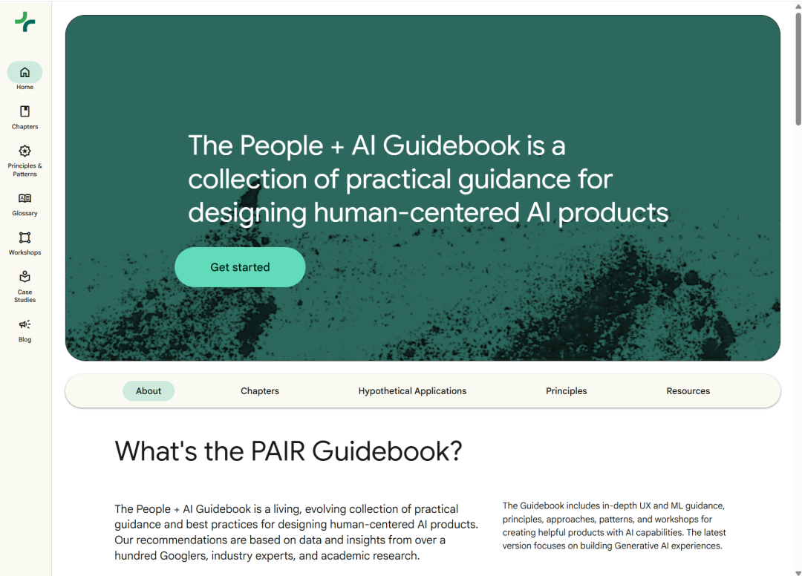

最近在整理 Explainable AI（XAI，可解释人工智能）的学习资料时，我发现一个很明显的问题：搜索“XAI入门”，排在前面的往往还是 SHAP、LIME、特征重要性和反事实解释。它们当然重要，但如果你正在研究大语言模型，或者关心解释能不能真正帮助用户，仅靠这些关键词已经很难看清这个领域的全貌。

今天人们所说的“可解释 AI”，可能在问四个不同的问题：

1. **模型为什么做出这次预测？**
   这是经典可解释机器学习关心的问题。SHAP、LIME、特征归因和反事实解释主要属于这里。
2. **模型内部究竟进行了什么计算？**
   这是 Mechanistic Interpretability，也就是机制可解释性试图回答的问题。它关注 Transformer 内部的注意力头、特征、回路和激活，而不只是输入输出之间的统计关系。
3. **这份解释真的能帮助人做判断吗？**
   这是 Human-Centered XAI 的核心。解释看起来合理，并不代表用户能正确理解它，更不代表它能改善决策。
4. **解释模型能不能帮助我们发现风险？**
   在 AI Safety 语境下，人们希望借助可解释性发现欺骗、目标错位、危险能力或者异常行为。但这条线与机制可解释性高度重叠，并不是一个边界清晰、独立存在的学科分支。

这四类问题使用的工具、论文和评价标准并不相同。把它们混在一起，最常见的结果就是：收藏了一大堆资料，却依然不知道应该从哪里开始。

所以这篇文章不准备继续堆一张“越长越专业”的链接清单。我想提供的是一张学习地图：你可以先判断自己要解决什么问题，再选择真正值得投入时间的资源。

## 路线一：如果你要解释传统机器学习模型

最适合作为起点的资源，仍然是 Christoph Molnar 写的书《Interpretable Machine Learning》。这本书免费在线阅读。它的价值不只是介绍 LIME、SHAP、反事实解释、PDP 和特征重要性，更重要的是，它会不断提醒读者：一种解释方法在什么条件下可能失效。

例如，模型给出了一张很漂亮的特征重要性图，并不意味着这些特征与结果之间存在因果关系；局部解释在一个样本附近成立，也不代表它能描述模型的整体行为；两个高度相关的特征，还可能让归因结果变得相当难解释。

因此，我建议不要从头到尾硬啃这本书。初学者可以先读 Interpretability、Goals of Interpretability 和 Methods Overview 三章，建立地图，再按照实际需要查具体方法。这也正是作者给出的阅读建议。

如果要继续读论文，可以从四篇经典工作开始：

- Guidotti 等人的黑箱模型解释方法综述；
- Barredo Arrieta 等人关于 XAI 分类、机会和挑战的综述；
- Tim Miller 从社会科学角度讨论“什么才算解释”的论文；
- Cynthia Rudin 等人总结可解释机器学习基本原则和十大挑战的论文。

前两篇帮助你认识方法，后两篇则会逼着你重新思考一个更基础的问题：我们真正需要的是给黑箱模型增加一层解释，还是应该尽量使用本身就可理解的模型？

## 路线二：如果你想研究大语言模型内部

如果你真正好奇的是“Transformer 内部到底学会了什么”，那么只学习 SHAP 和 LIME 并不够。你要进入的是 Mechanistic Interpretability。

这条路线目前比较好的实践入口是 **ARENA**。这是一套 AI Safety 技术课程。它的第一章集中讲 Transformer Interpretability，内容包括 TransformerLens、Induction Heads、线性探针、Sparse Autoencoders、Circuit 分析和 Activation Patching 等。ARENA 当前课程目录

如果只是想了解概念，可以先阅读课程说明；如果想真正进入这个方向，最好亲自完成其中的实验。机制可解释性非常依赖动手：只有实际缓存激活、干预模型组件并观察输出变化，才会逐渐理解“找到相关性”和“找到因果机制”之间的差别。

第二个绕不开的入口是 **Neel Nanda**。他创建了 TransformerLens，目前负责 Google DeepMind 的机制可解释性团队。他的博客、术语解释和公开视频，很适合用来建立研究直觉。

再往后，则可以长期关注 **Anthropic** 的 Transformer Circuits。这里集中发布了从 superposition、monosemanticity、稀疏自编码器到 circuit tracing 的一系列工作。到 2026 年，这个站点仍在持续更新新的可解释性研究。Transformer Circuits

不过，这条路线也有一个需要反复提醒自己的问题：我们在小模型或局部回路中找到的机制，能否扩展到真正的大模型？一张看起来清晰的 attribution graph，又是否已经足以说明模型“为什么”产生某个答案？

目前这些问题仍然没有简单答案。

## 路线三：如果你关心的是“解释有没有用”

很多技术工作隐含着一个假设：只要解释足够忠实、足够精确，用户自然就能从中受益。

Human-Centered XAI 对这个假设提出了挑战。

一份解释可能在数学上没有问题，却让用户产生错误的信任；它也可能给出太多信息，使人无法抓住真正影响决策的因素。不同角色需要的解释也不一样：开发者想排查模型错误，医生想判断建议是否可信，受算法决策影响的人则可能只想知道：“我要改变什么，结果才会不同？”

Tim Miller 在<strong>《Explanation in Artificial Intelligence: Insights from the Social Sciences》</strong>中指出，人类通常偏好具有选择性、对比性并适应具体语境的解释。人不是在索取一份关于模型的完整技术报告，而是在问：

**为什么是这个结果，而不是另一个结果？**

但人机协作还要再向前一步：一份好的解释不仅要让人看懂，还要在正确的时间、通过合适的界面，帮助人和自主系统完成共同任务。

<strong>《Explainable Interface for Human-Autonomy Teaming: A Survey》</strong>专门讨论了这个问题。它区分了三个容易混淆的概念：

- 模型是否具有可解释性；
- 系统生成了什么解释；
- 解释怎样通过界面呈现给人。

这一区分很重要。模型内部的信息即使足够丰富，如果界面在错误的时间展示了错误的内容，仍然可能干扰判断。反过来，一个看起来很直观的界面，也可能展示并不忠实于模型实际机制的解释。

因此，人机协同中的解释不能只用模型指标评价。还需要同时考察：

- 解释是否忠实于模型；
- 用户能否正确理解系统；
- 解释是否造成过度信任或不必要的不信任；
- 人与自主系统的团队是否因此表现得更好。

如果研究方向涉及自动驾驶、医疗决策、机器人、指挥控制或其他人机协同系统，这篇综述可以接在 Tim Miller 的论文之后阅读：前者帮助我们理解人需要怎样的解释，后者则把问题推进到“怎样把解释设计成可用的交互界面”。

产品设计者还可以参考 Google PAIR 的 **People + AI Guidebook**。它不会教你推导 SHAP，而是讨论什么时候应该解释、怎样帮助用户形成合理的心理模型，以及是否应该展示模型置信度。对于真正需要把 XAI 放进产品的人，这类材料往往比再学习一种归因算法更实用。

## 三篇专门用来“降温”的论文

学习 XAI 很容易陷入一种工具思维：模型是黑箱，那就选一种解释方法套上去。

但在真正使用这些工具之前，最好先读三篇对“可解释性”本身提出质疑的论文。

Zachary Lipton 的《The Mythos of Model Interpretability》追问：我们说一个模型“可解释”，到底是在说它足够简单、可以被人模拟，还是说它能在预测之后给出一套说明？这些目标并不相同，也不一定能由同一种方法实现。Finale Doshi-Velez 和 Been Kim 的《Towards a Rigorous Science of Interpretable Machine Learning》继续追问：如果一种方法声称自己更可解释，我们怎样验证？他们提出了从不依赖具体用户的形式化评价，到受控人工实验，再到真实应用场景评价的不同层次。Cynthia Rudin 的观点更加直接：在医疗、司法等高风险决策中，与其先使用复杂黑箱，再给它添加一个可能并不忠实的事后解释，不如优先考虑本身可解释的模型 （https://arxiv.org/abs/1811.10154）。

这三篇论文共同提醒我们：

**生成一份解释，不等于获得了理解；看起来合理，也不等于解释忠实；在黑箱之外增加一个解释器，更不一定是所有问题的最佳答案。**

## 两个值得长期关注的讨论社区

### LessWrong

LessWrong 的 Interpretability 标签页汇集了大量机制可解释性研究笔记、开放问题、论文解读和方法争论。这里的文章不等同于经过同行评审的论文，质量和成熟度也不完全一致。但它有一个论文数据库不容易替代的价值：研究者会更早、更坦率地讨论失败结果、尚未成形的想法，以及对主流方法的怀疑。阅读时建议把它当成“研究讨论现场”，而不是权威教材。看到有价值的技术结论后，仍然应该回到原论文、代码和实验结果核对。

### Alignment Forum

Alignment Forum 同样设有 Interpretability 专题，但讨论更集中于可解释性与 AI Safety、AI Alignment 的关系，例如：

- 可解释性怎样帮助发现欺骗或目标错位；
- 研究小型 circuit 是否真的能降低前沿模型的风险；
- 可解释性工具可能给防御方还是能力开发带来更大收益；
- 怎样衡量一项 interpretability 工作产生了实际安全价值。

LessWrong 和 Alignment Forum 之间存在内容交叉，有些文章会同时出现。因此，与其把它们当成两个需要每天刷新的社区，不如订阅 Interpretability 标签，在出现新方法或重要争议时集中阅读。

如果说 Transformer Circuits 更像正式研究成果的主线，那么 LessWrong 和 Alignment Forum 更像这个领域的公开研究讨论室。

## 不要收集所有资源，先选择自己的问题

如果你的工作对象是表格数据和传统预测模型，可以从 Molnar 的书开始，配合 SHAP、InterpretML 和 DiCE等实践。

如果你想研究语言模型内部机制，可以从 ARENA 和 TransformerLens 开始，再跟进 Transformer Circuits。

如果你更关心解释如何影响人的理解和决策，文中提到的总数以及 Q.Vera Liao 的工作可能会更对口。

这三条路线之间存在联系，但没有必要同时啃透。可解释 AI 不是一张读完就能“通关”的书单。真正重要的是先确定：

**你想解释的是一次预测、模型内部的计算，还是人与 AI 之间的关系？**

这个问题的答案，会决定你接下来应该读什么，也关乎什么才算一份好的解释。

也可以看看探哥之前写的**XAI 101合集里的**内容还有前面的文章。

---

> 本文首发于微信公众号「XAI小探」，[阅读原文](https://mp.weixin.qq.com/s/Bz0-90-RuAw2ahPGLHr6eg)。


