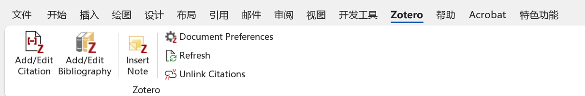
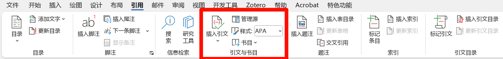
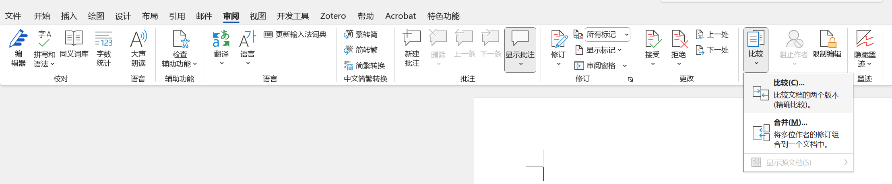

## 1. 按照官方模版设置样式

> 设置样式时可以在<span style="background:rgba(173, 239, 239, 0.55)">"视图"->"草稿"</span>模式中操作，比较方便查看内容所使用的样式。

1. 首先在官网下载当年的word模版，有些提交送审版和后面publish版会不同，注意区分。
2. 复制一份模版作为备份和对照。
3. 然后在自己写好的文字内容粘贴到word模版中，按`Ctrl+Shift+Alt+S`调出官方定义好样式表。
4. 对照模版，需要哪样式就选中文字后点击样式表中的样式进行调整。



## 2. 如何设置交叉引用？
### 2.1 文献管理工具
> 强烈推荐使用zotero或者mendeley进行文献管理和在word中插入引用。

以我使用的zotero为例，安装后会在word中出现这样一个选项卡，然后不管是**插入引用**，**生成引用列表**或者是**修改引文样式**都很简单。



<div style="display: flex; justify-content: space-between;">
    
    
</div>

---
###  2.2 手动插入

**方法一：**

1. 在相应位置插入占位符，方便后面记得引用位置。
2. 在文章末尾插入Reference list，把引用的文章列表按格式编辑好。
3. 然后 <span style="background:rgba(173, 239, 239, 0.55)">“插入” -> “交叉引用” </span>或者 <span style="background:rgba(173, 239, 239, 0.55)">“引用” -> “交叉引用” </span>引用相应的条目。

**方法二：**

1. 在相应位置插入占位符，方便后面记得引用位置。
2. 在要添加引用的地方 <span style="background:rgba(173, 239, 239, 0.55)">“引用” -> “插入引文” -> “添加新源”</span>



3. 在文末通过 <span style="background:rgba(173, 239, 239, 0.55)">"引用" -> "书目" -> "插入书目"</span>生成引用列表 ，可以通过“引文样式”修改引文格式。

**如果手动设置交叉引用，还会遇到一个连续多项引用的样式调整问题**

比如要实现以“[1-3]”交叉引用格式，且更新域后不受影响，那么可以这样做。
如果要实现[1, 3]交叉引用格式，同理。

1. 分别使用“交叉引用”依次插入所需引用文献的第一个和最后一个，比如“[1] [3]”；
2. 在引用处对两个编号操作：<span style="background:rgba(173, 239, 239, 0.55)">“点击鼠标右键” - 选择“切换域代码”</span>；

```
[1]变为{REF _Ref444874348 \r \h}
[3]变为{REF _Ref444874357 \r \h}
```

3. 分别后面加入字符#“[0”、#“0]”，修改后

```
[1]的域代码变为 {REF _Ref444874348 \r \h\#"[0"}  
[3]的域代码变为 {REF _Ref444874357 \r \h\#"0]"}
```

4. 用鼠标分别选择修改过的代码域，右键点击更新域，引用号码变为”[13]“，在中间加上破折号得到”[1-3]“。


## 3. 多人协作时如何比较修订前后版本的不同？
多人协作时我们比较后一个版本和前一个版本的不同可以借助word的比较功能。

位于<span style="background:rgba(173, 239, 239, 0.55)">“审阅” -> "比较"</span>，然后选择修改后的文档和要对比的之前的文档点击确定就可以看到结果了。


